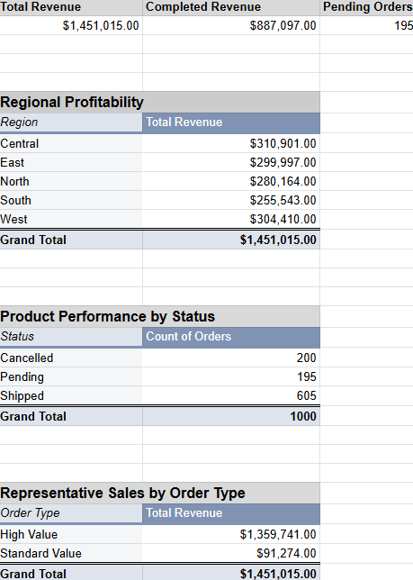
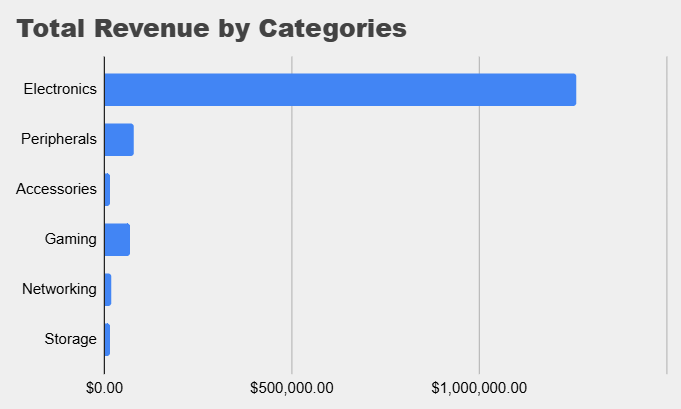
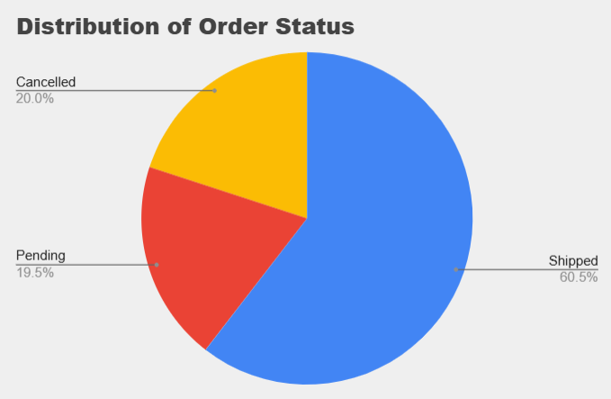

# E-Commerce Sales Analysis Dashboard (Google Sheets)

## Project Overview

This project analyzes e-commerce sales data using **Google Sheets** to build a business dashboard featuring KPI calculations, pivot table analysis, and data visualizations. The dashboard demonstrates a typical sales reporting workflow used by business analysts and operations teams.

## Dashboard Preview

The final dashboard summarizes key business metrics, regional profitability, product performance, representative sales by order type, and order status distribution using pivot tables and charts.

## Business Objectives

* Calculate total revenue for every order
* Classify orders into **High Value** and **Standard Value**
* Build KPI summary metrics
* Analyze revenue by region
* Evaluate product performance across order statuses
* Analyze sales representative performance by order type
* Visualize revenue and order status distribution

## Tools Used

* Google Sheets
* Microsoft Excel
* Pivot Tables
* Spreadsheet Formulas
* Data Visualization Charts

## Project Workflow

### Task 1: Data Preparation & Derivation

* Total Revenue calculation
* Order Type classification (High Value / Standard Value)

### Task 2: Aggregation & Conditional Counting

* Total Revenue
* Completed Revenue (Shipped)
* Pending Orders count

### Task 3: Pivot Table Analysis

* Regional Profitability
* Product Performance by Status
* Representative Sales by Order Type

### Task 4: Dashboard Visualizations

* Revenue by Category (Bar Chart)
* Order Status Distribution (Pie Chart)

## Key Performance Indicators

| Metric            |          Value |
| ----------------- | -------------: |
| Total Revenue     | **$1,451,015** |
| Completed Revenue |   **$887,097** |
| Pending Orders    |        **195** |

## Dashboard Components

### Revenue by Category

### Order Status Distribution

## Regional Profitability Summary

| Region  | Total Revenue |
| ------- | ------------: |
| Central |      $310,901 |
| West    |      $304,410 |
| East    |      $299,997 |
| North   |      $280,164 |
| South   |      $255,543 |

## Repository Structure

* `data/` - Source dataset and completed Excel workbook
* `dashboard/` - Dashboard and visualization screenshots
* `docs/` - Project documentation (optional)
* `README.md` - Project documentation

## Skills Demonstrated

* Spreadsheet modeling
* Data preparation and transformation
* Conditional formulas
* KPI reporting
* Pivot table analysis
* Dashboard creation
* Business data visualization

## Author

**Amrish Yadav**

If you found this project useful, feel free to star the repository.
